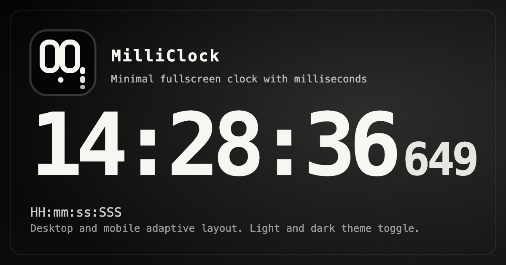

# MilliClock

`MilliClock` 是一个极简的全屏毫秒时钟网页应用，默认以 `HH:mm:ss:SSS` 格式实时显示当前时间，并自动放大到尽可能占满屏幕。项目当前以纯静态页面形式实现，无需安装依赖，也不需要构建流程。

## 使用方式

- 正式地址：[https://milliclock.ohho.wang/](https://milliclock.ohho.wang/)
- 本地预览：直接打开 [index.html](./index.html) 即可使用，无需安装依赖或启动服务。

